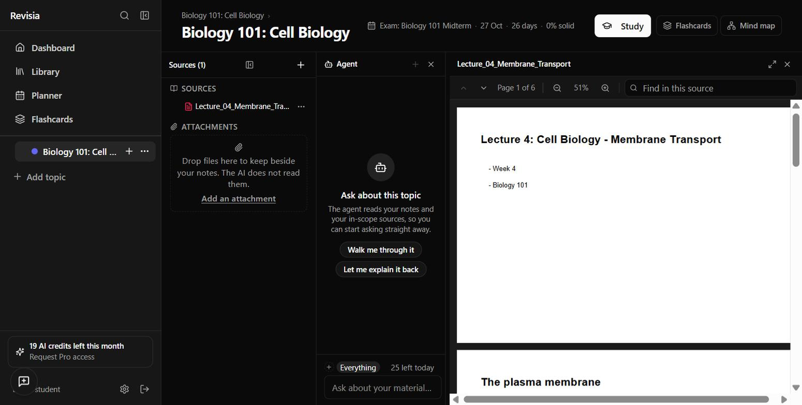
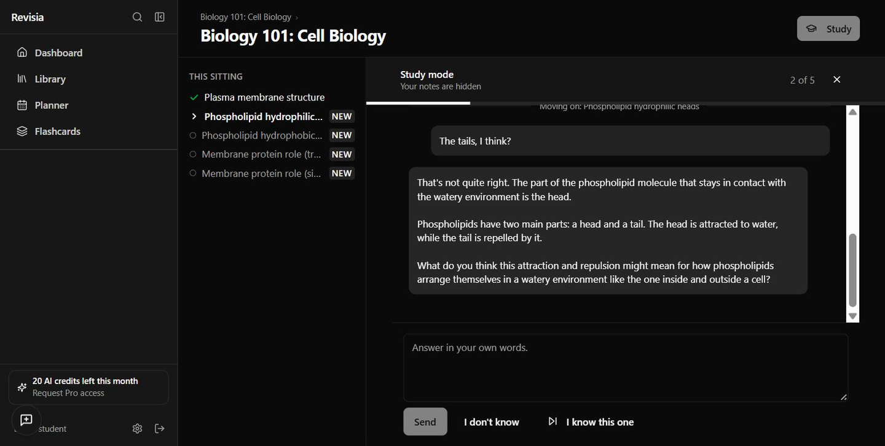
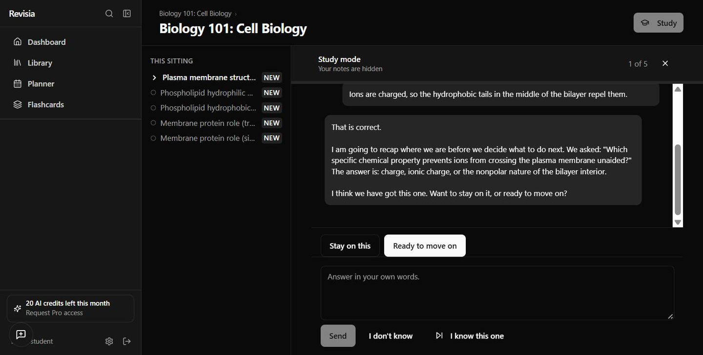
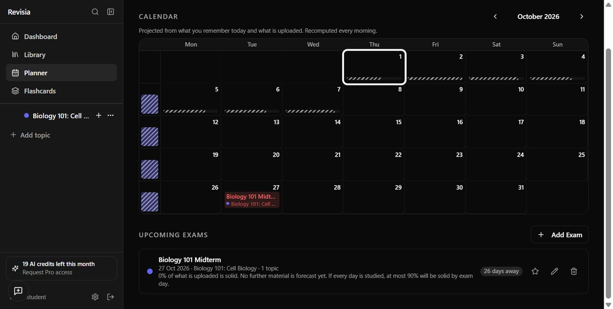
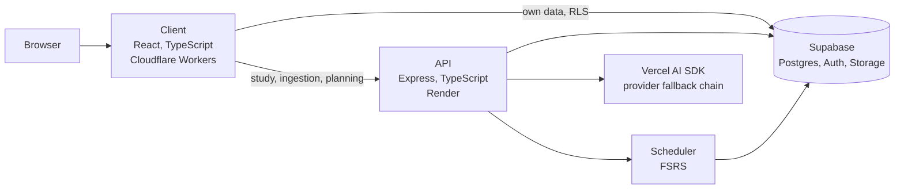

# Revisia

AI-assisted revision for university courses. Revisia extracts concepts from lecture material, tests students on them through closed-book recall, and schedules review against exam dates.

Built solo: product, architecture, AI pipeline and infrastructure.

Status: Closed alpha with student testers.

<!-- Demo video goes here (60 to 90 seconds, end to end). -->

## Screenshots

Lecture source attached to a topic, with its exam.

Study session: concept queue and tutor feedback after an incorrect answer.

Closed-book recall, with source material hidden.

Planner: exam date and projected readiness.

## How it works

**Concept extraction.** Uploaded slides and notes are split into atomic concepts, each testable by a single question. Extraction runs in stages; a single pass over a full lecture under-extracts by roughly 7x. Figure reading and transcript alignment are in progress.

**Knowledge model.** Each concept's state (untested, held, fading) is derived from an append-only log of graded answers. Held requires repeated unassisted recall across separate sessions. Hinted answers and answers given immediately after instruction are recorded but do not count.

**Tutor and grading.** Study is conversational, question-first, with instruction only after a miss. Routing a message (attempt, question, deflection) and grading an answer are separate components. Grading runs against a stored reference answer, and the tutor has no write access to the knowledge model.

**Exam-aware scheduling.** FSRS models recall probability per concept. The planner works backwards from exam dates and reports current and maximum attainable readiness.

## Architecture

The client handles its own data directly under row-level security. Grading, study state, ingestion and planning go through the API.

## Engineering

1,800+ automated tests across client, server and shared packages, with database tests run against a local Supabase stack. CI on a self-hosted runner. Separate development and production environments; production advances only through an explicit promote step that applies pending migrations in order.

## Stack

TypeScript, React, Supabase, Vercel AI SDK, FSRS.

Source is private. Happy to walk through the code on request.
